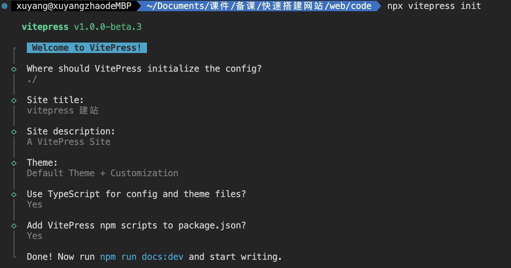
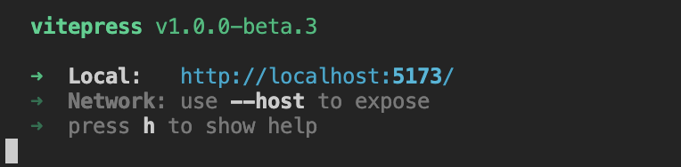
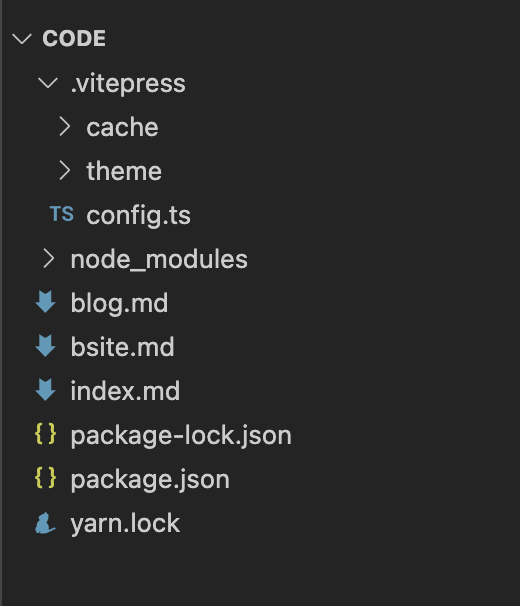
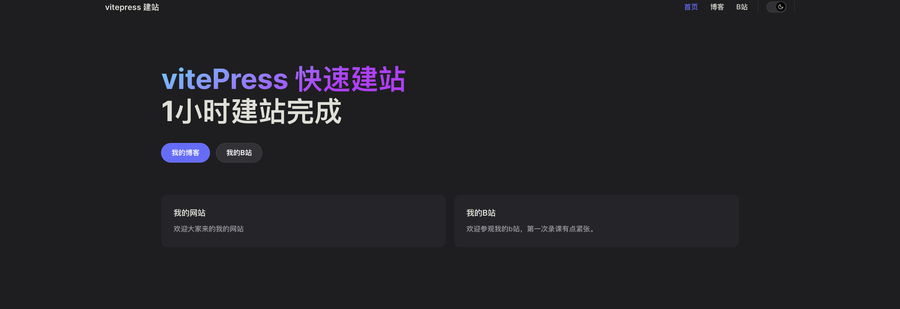
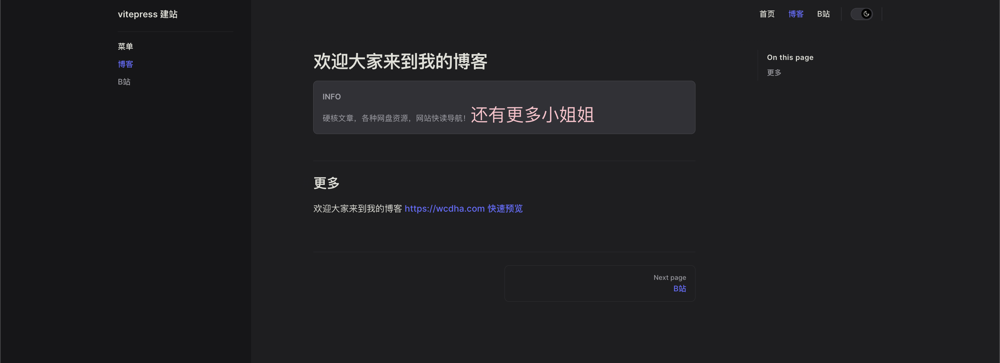

# 快速搭建网站-WEB篇

> 使用技术 VitePress

[vitepress 快速开始](https://vitepress.dev/guide/getting-started)

### 快速使用

1.  npm install -D vitepress
2.  npx vitepress init

3. npm run docs:dev

   

4. 菜单目录 .vitepress 是默认主题配置 .md 则是页面展示的内容

7. 可以看到这个项目目录很简单我们只需要更改xxx.md文件就可以自动生成网页了！是不是很神奇呢。

   8. 不到20分钟网站就搭建完了。

      

   9. 打包 npm run docs:build dist就是压缩过静态文件。

      