# 求求别再不懂跨域了

> CORS，全称Cross-Origin Resource Sharing，是一种允许当前域（domain）的资源（比如html/js/web service）被其他域（domain）的脚本请求访问的机制，通常由于同域安全策略（the same-origin security policy）浏览器会禁止这种跨域请求。

> CORS是一种允许当前域（domain）的资源（比如html/js/web service）被其他域（domain）的脚本请求访问的机制，通常由于同域安全策略（the same-origin security policy）浏览器会禁止这种跨域请求。

> 简单的说，端口、域名、协议不同时，都会触发跨域。举个例子，https://wcdha.com/ 请求 http://wcdha.com/ 这很明显协议不同，也会存在跨域。

---
> 现在思考一下，在哪一步跨域呢？如果跨域了，接口还会调用吗？

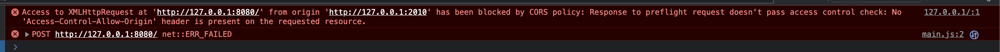

<center>跨域的报错</center>

### 接下来解决一下这个跨域。

​	* 见报错需要请求头添加 Access-Control-Allow-Origin 属性。

## Access-Control-Allow-Origin

```
Access-Control-Allow-Origin 响应标头指定了该响应的资源是否被允许与给定的来源（origin）共享
*                       通配符，从而允许任意来源的请求代码都具有访问资源的权限。
http://127.0.0.1:2010   只允许这个地址访问。
```

​    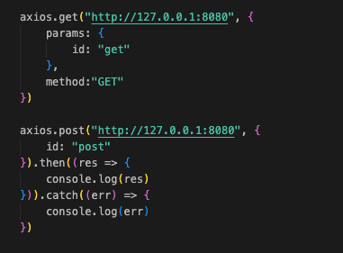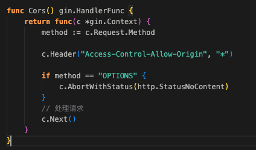

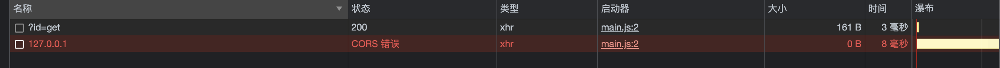

### 同时发起了POST GET 请求，显而易见POST还是报错cors，还是报错跨域。而GET却成功了，这是为什么呢？

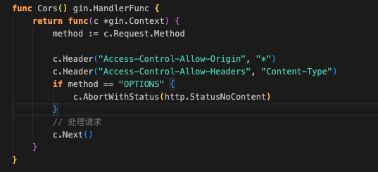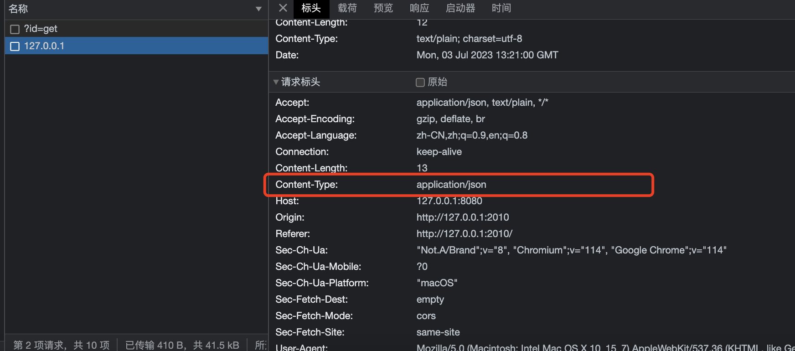

### 更改下代码，在服务端添加一个header Access-Control-Allow-Headers：Content-Type，因为POST会自动添加请求头Content-Type而GET是不会自己添加的。

## Access-Control-Allow-Headers

```
Access-Control-Allow-Headers 响应首部 Access-Control-Allow-Headers 用于 preflight request（预检请求）中，列出了将会在正式请求的 Access-Control-Request-Headers 字段中出现的首部信息。
Access-Control-Allow-Headers: <header-name>[, <header-name>]*
Access-Control-Allow-Headers: *
```

### 接下来展开说一下什么是（预检请求）

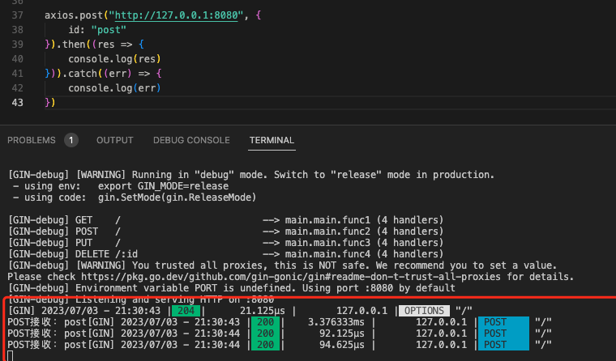

### 第一发送POST请求会先发送一个预请求，如果不存在跨域，则可以访问，存在跨域，则不发送POST请求。现在可以解答了，上面的问题，“如果跨域了，服务端可以收到请求，则不会执行代码”。也不都是所有请求方式都需要发送预请求，

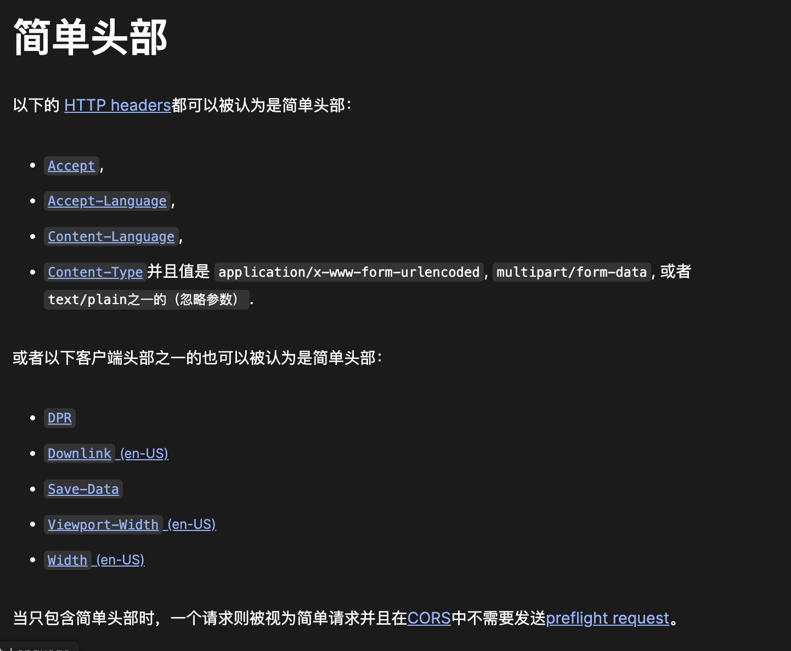

### 简单的说：我们发送一个最简单的GET请求，就不会发送预请求。

### Access-Control-Max-Age：10  设置预请求缓存时间为10秒。

```
Access-Control-Max-Age: 600 将预检请求的结果缓存 10 分钟：
```

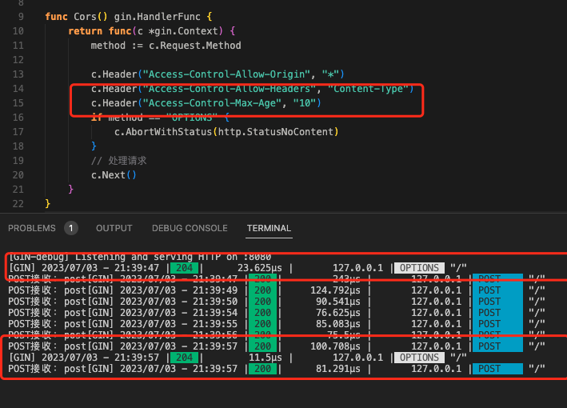

## Access-Control-Allow-Methods

响应首部 **`Access-Control-Allow-Methods`** 在对 [preflight request](https://developer.mozilla.org/zh-CN/docs/Glossary/Preflight_request).（预检请求）的应答中明确了客户端所要访问的资源允许使用的方法或方法列表。

```
Access-Control-Allow-Methods: <method>, <method>, ...
```

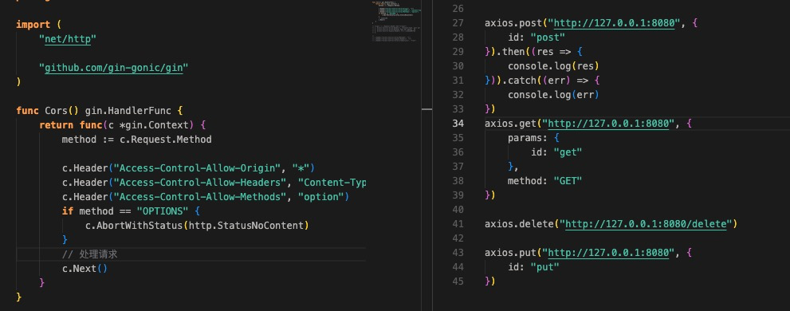

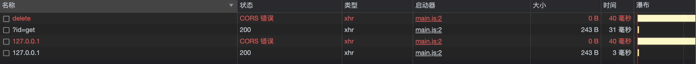

### Access-Control-Allow-Methods 设置了Options预加载，但是POST，GET可以请求通，PUT，DELETE请求不通了。原因Access-Control-Allow-Methods默认配置POST，GET。

## Access-Control-Expose-Headers

响应标头 **`Access-Control-Expose-Headers`** 允许服务器指示那些响应标头可以暴露给浏览器中运行的脚本，以响应跨源请求。

```
Access-Control-Expose-Headers: [<header-name>[, <header-name>]*]
Access-Control-Expose-Headers: *
```

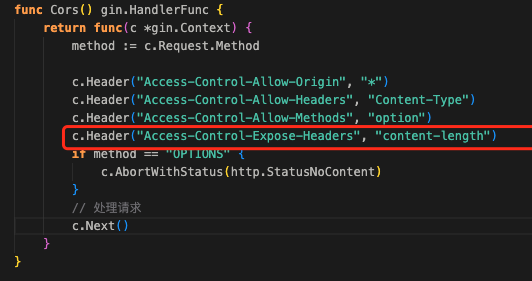

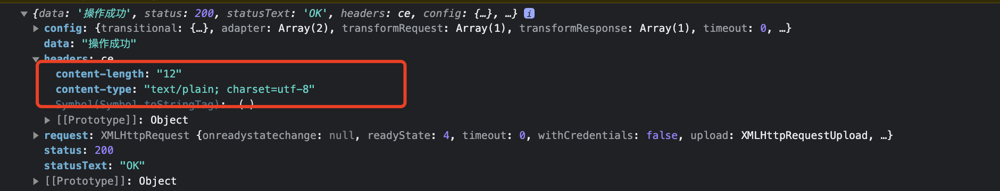

### 设置了Access-Control-Expose-Headers：content-length。前端只可以获取请求头content-length。

# Access-Control-Allow-Credentials

**`Access-Control-Allow-Credentials`** 响应头用于在请求要求包含 credentials（[`Request.credentials`](https://developer.mozilla.org/zh-CN/docs/Web/API/Request/credentials) 的值为 `include`）时，告知浏览器是否可以将对请求的响应暴露给前端 JavaScript 代码。

当请求的 credentials 模式（[`Request.credentials`](https://developer.mozilla.org/zh-CN/docs/Web/API/Request/credentials)）为 `include` 时，浏览器仅在响应标头 `Access-Control-Allow-Credentials` 的值为 `true` 的情况下将响应暴露给前端的 JavaScript 代码。

Credentials 可以是 cookies、authorization headers 或 TLS client certificates。

当作为对预检请求的响应的一部分时，这能表示是否真正的请求可以使用 credentials。注意简单的[`GET`](https://developer.mozilla.org/zh-CN/docs/Web/HTTP/Methods/GET) 请求没有预检，所以若一个对资源的请求带了 credentials，如果这个响应头没有随资源返回，响应就会被浏览器忽视，不会返回到 web 内容。

`Access-Control-Allow-Credentials` 标头需要与 [`XMLHttpRequest.withCredentials`](https://developer.mozilla.org/zh-CN/docs/Web/API/XMLHttpRequest/withCredentials) 或 Fetch API 的 [`Request()`](https://developer.mozilla.org/zh-CN/docs/Web/API/Request/Request) 构造函数中的 `credentials` 选项结合使用。Credentials 必须在前后端都被配置（即 `Access-Control-Allow-Credentials` header 和 XHR 或 Fetch request 中都要配置）才能使带 credentials 的 CORS 请求成功。

```
Access-Control-Allow-Credentials: true
```

### 这个API 通俗易懂就是，你想要接口传入cookie，会报错跨域，但是但是呢。

### 前端设置 axios.defaults.withCredentials = true

### 后端设置请求头 c.Header("Access-Control-Allow-Credentials", "true") 就不报错了。

> 以下注意的点
>
> c.Header("Access-Control-Allow-Origin", "http://127.0.0.1:201") 要填写全路径，不能填写*。

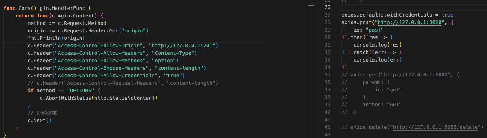

# Access-Control-Request-Headers

请求头 **`Access-Control-Request-Headers`** 出现于 [preflight request](https://developer.mozilla.org/zh-CN/docs/Glossary/Preflight_request)（预检请求）中，用于通知服务器在真正的请求中会采用哪些请求头。

```
Access-Control-Request-Headers: <header-name>, <header-name>, ...
```

# Access-Control-Request-Method

请求头 **`Access-Control-Request-Method`** 出现于 [preflight request](https://developer.mozilla.org/zh-CN/docs/Glossary/Preflight_request)（预检请求）中，用于通知服务器在真正的请求中会采用哪种 [HTTP 方法](https://developer.mozilla.org/zh-CN/docs/Web/HTTP/Methods)。因为预检请求所使用的方法总是 [`OPTIONS`](https://developer.mozilla.org/zh-CN/docs/Web/HTTP/Methods/OPTIONS) ，与实际请求所使用的方法不一样，所以这个请求头是必要的。

```
Access-Control-Request-Method: <method>
```

## 最终跨域请求头配置

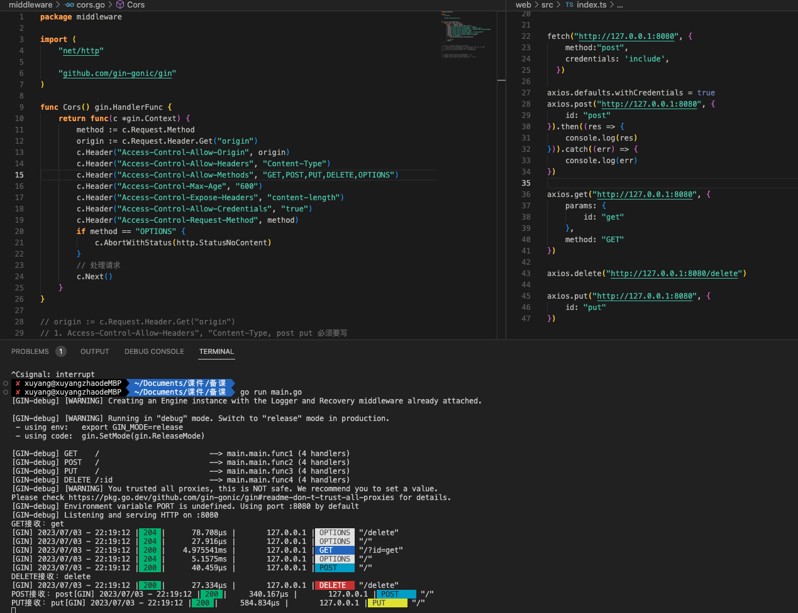

## 解决跨域的多种办法
1. 开发环境 Proxy 代理，原理利用服务器请求，在返回前端。
2. 正式环境老朋友neginx，和proxy原理一样，服务器请求。
3. JSONP
```
// 前端
<script scr="https://wchda.com?callback=cb"></script>
func cb(options){
	console.log(options)
}
// 后端
"cb(
	[1,2,3]
)"
```

### 参考链接
1. https://baike.baidu.com/item/CORS/16411212?fr=ge_ala
2. https://developer.mozilla.org/zh-CN/docs/Web/HTTP/Headers/Access-Control-Allow-Credentials