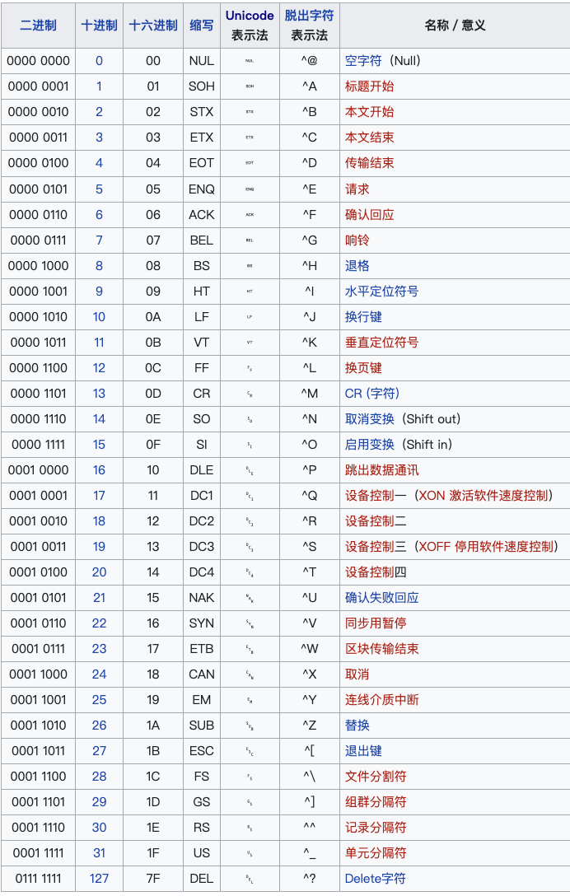
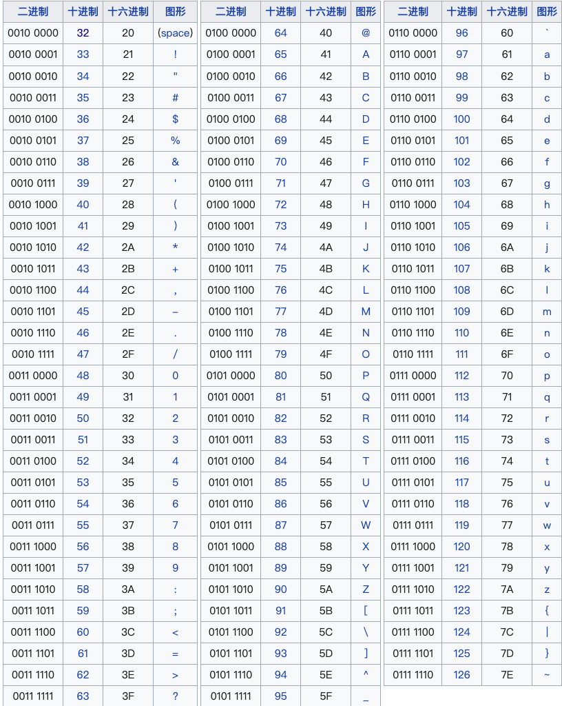
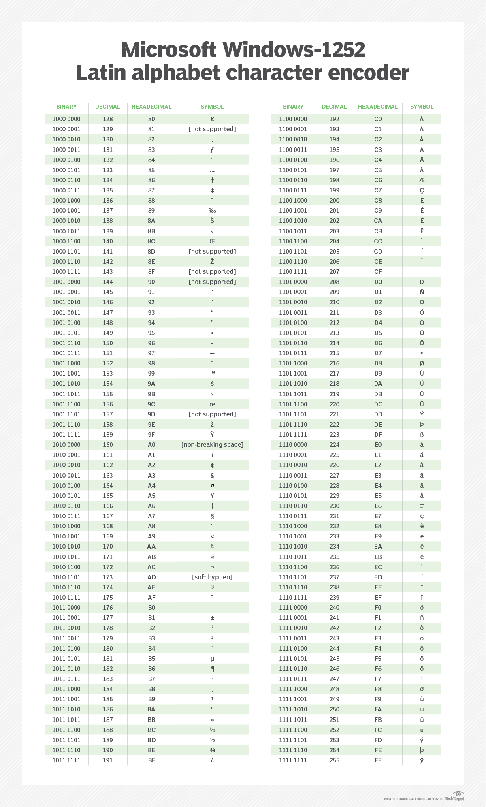
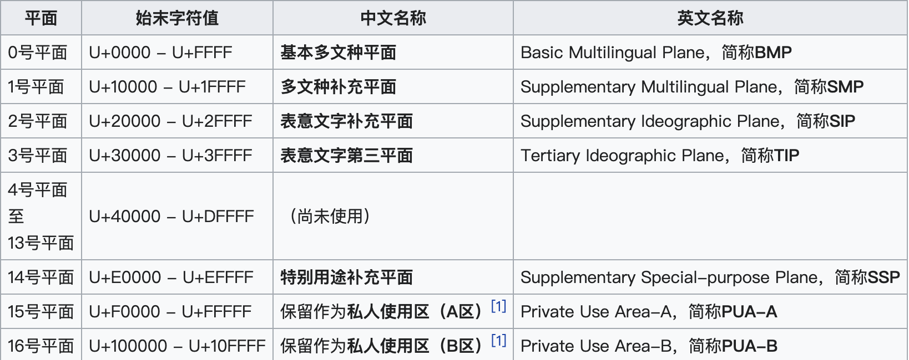

# ASCII，UNICODE 区别

> 工具推荐：[进制转换](https://wcdha.com/tools/hex/) [unicode编码查看器](https://wcdha.com/tools/encoded/?page=0_1)  [ascii编码查看器](https://wcdha.com/tools/ascii/) [UTF编码转换](https://wcdha.com/tools/encoded/unicodeInfo)

## 简介
> ASCII (American Standard Code for Information Interchange)：美国信息交换标准代码是基于拉丁字母的一套电脑编码系统，主要用于显示现代英语和其他西欧语言。它是最通用的信息交换标准，并等同于国际标准 ISO/IEC 646。ASCII第一次以规范标准的类型发表是在1967年，最后一次更新则是在1986年，到目前为止共定义了128个字符

## 产生原因
> 在计算机中，所有的数据在存储和运算时都要使用二进制数表示（因为计算机用高电平和低电平分别表示1和0），例如，像a、b、c、d这样的52个字母（包括大写）以及0、1等数字还有一些常用的符号（例如*、#、@等）在计算机中存储时也要使用二进制数来表示，而具体用哪些二进制数字表示哪个符号，当然每个人都可以约定自己的一套（这就叫编码），而大家如果要想互相通信而不造成混乱，那么大家就必须使用相同的编码规则，于是美国有关的标准化组织就出台了ASCII编码，统一规定了上述常用符号用哪些二进制数来表示。

> 美国信息交换标准代码是由美国国家标准学会(American National Standard Institute , ANSI )制定的，是一种标准的单字节字符编码方案，用于基于文本的数据。它最初是美国国家标准，供不同计算机在相互通信时用作共同遵守的西文字符编码标准，后来它被国际标准化组织（International Organization for Standardization, ISO）定为国际标准，称为ISO 646标准。适用于所有拉丁文字字母

## 控制字符




<center>ASCII控制字符（共33个）</center>

## 可显示字符
```
可显示字符编号范围是32-126（0x20-0x7E），共95个字符。
32～126(共95个)是字符(32是空格)，其中48～57为0到9十个阿拉伯数字。
65～90为26个大写英文字母，97～122号为26个小写英文字母，其余为一些标点符号、运算符号等。
```



<center>ASCII可显示字符（共95个）</center>

## 补充字符
> 使用 Microsoft Windows-1252拉丁字母字符编码器，可查看补充字符ascii



<center>扩展 ASCII 字符包括从 128 (1000 0000) 到 255 (1111 1111) 的二进制值</center>

## 缺点
> 英语用128个符号编码就够了，但是用来表示其他语言，128个符号是不够的。比如，在法语中，字母上方有注音符号，它就无法用 ASCII 码表示。于是，一些欧洲国家就决定，利用字节中闲置的最高位编入新的符号。比如，法语中的é的编码为130（二进制10000010）。这样一来，这些欧洲国家使用的编码体系，可以表示最多256个符号。
但是，这里又出现了新的问题。不同的国家有不同的字母，因此，哪怕它们都使用256个符号的编码方式，代表的字母却不一样。比如，130在法语编码中代表了é，在希伯来语编码中却代表了字母Gimel (ג)，在俄语编码中又会代表另一个符号。但是不管怎样，所有这些编码方式中，0--127表示的符号是一样的，不一样的只是128--255的这一段。
至于亚洲国家的文字，使用的符号就更多了，汉字就多达10万左右。一个字节只能表示256种符号，肯定是不够的，为了解决这个问题，就出现了Unicode。

# 什么是Unicode
> 统一码（Unicode），也叫万国码、单一码，由统一码联盟开发，包含了全世界的编码，为每个编码设置了唯一的编号。

> Unicode现在的规模可以容纳100多万个符号。每个符号的编码都不一样，通过[unicode.org](unicode.org)&nbsp;&nbsp;&nbsp;
[unicode在线编码表](http://www.chi2ko.com/tool/CJK.htm)查看

> Unicode 主流的是编码格式为：UTF-8 UTF-16 UTF-32
## Unicode平面
> 目前的Unicode字符分为17组编排，每组称为平面（Plane），而每平面拥有65536（即216）个代码点。然而目前只用了少数平面。


1. Plane 0（零号平面）的码位是从 0000 - FFFF（16 进制的 4 个 0 等于 2 进制的 16 个 0，代表 16 bit）。
2. Plane 0 包含了最常用的字符，也被称为 Basic Multilingual Plane（基本多文种平面，简称 BMP），共支持六万多个字符。
3. 其他的 Plane 1 - Plane 16 被称为辅助平面。
4. Plane 4 - Plane 13 目前还是完全没有被使用到的
5. Plane 15 和 16 是可以进行自定义编码的
> 例如 中的十六进制为4e2d十进制为20013,在0平面上。平面和unicode转换utf有关系，需要了解请查看“unicode转utf文章”。
## 参考链接
> https://wcdha.com/tools/ascii/

>https://zh.wikipedia.org/wiki/ASCII

> https://www.techtarget.com/whatis/definition/ASCII-American-Standard-Code-for-Information-Interchange?Offer=abt_pubpro_AI-Insider
