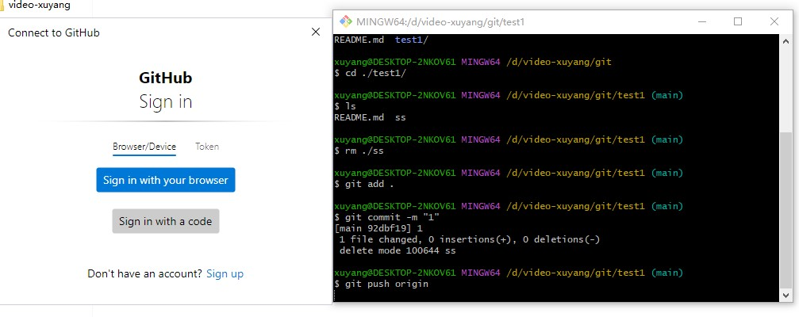
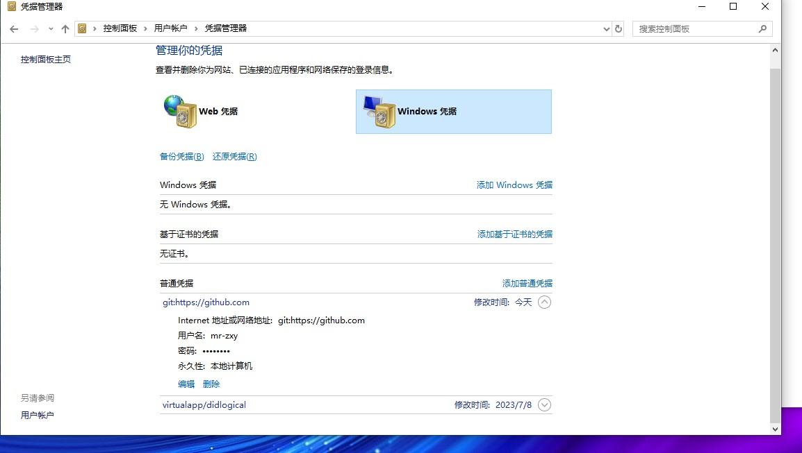
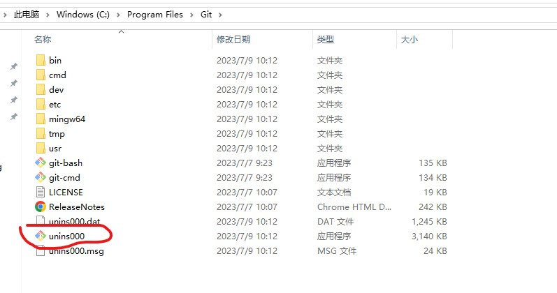

# 你还在为git无法提交代码发愁吗
## 安装
> https://git-scm.com/
## 中文文档 https://docs.github.com/zh/enterprise-server@3.6/get-started/getting-started-with-git/setting-your-username-in-git
## 设置 Git 用户名 邮箱
>  当你安装Git后首先要做的事情是设置你的用户名称和e-mail地址。这是非常重要的，因为每次Git提交都会使用该信息。它被永远的嵌入到了你的提交中：
```
git config --global user.name "" 用户名
git config --global user.email "" 邮箱
git config --global core.autocrlf true 设置采用哪种换行符方式 win 设置true mac设置input
git config --global -l 查看
git config --global --unset user.name 删除配置项
```
> 只需要做一次这个设置，如果你传递了–global 选项，因为Git将总是会使用该信息来处理你在系统中所做的一切操作。如果你希望在一个特定的项目中使用不同的名称或email地址，你可以在该项目中运行该命令而不要–global选项。 总之–global为全局配置，不加为某个项目的特定配置

## 代理设置
> to github.com port 443 after 2070 ms: Couldn't connect to server 这个报错无法链接443https所以添加代理
```
> 添加代理
git config --global http.proxy http://127.0.0.1:7890
git config --global https.proxy http://127.0.0.1:7890
> 取消代理
git config --global --unset http.proxy
git config --global --unset https.proxy
```
## 克隆，提交代码身份权限验证! 1.本地电脑浏览器信任
> 1. 执行git push origin 会弹出以下弹框，点击sign in with you browser 进行验证，可以顺利提交代码。

> 2. 原理向电脑添加可信任网站凭证。

> 3. 缺点：基于本地电脑。如果换账号的情况下，需要先删除账号凭证，在添加凭证。很麻烦。

## 克隆，提交代码身份权限验证! 2.SSH 绑定
> ssh是什么 链接：https://www.ruanyifeng.com/blog/2011/12/ssh_remote_login.html
### git生成公钥步骤
> 如前所述，许多 Git 服务器都使用 SSH 公钥进行认证。 为了向 Git 服务器提供 SSH 公钥，如果某系统用户尚未拥有密钥，必须事先为其生成一份。 这个过程在所有操作系统上都是相似的。 首先，你需要确认自己是否已经拥有密钥。 默认情况下，用户的 SSH 密钥存储在其 ~/.ssh 目录下。 进入该目录并列出其中内容，你便可以快速确认自己是否已拥有密钥：

> 官网 https://git-scm.com/book/zh/v2/%E6%9C%8D%E5%8A%A1%E5%99%A8%E4%B8%8A%E7%9A%84-Git-%E7%94%9F%E6%88%90-SSH-%E5%85%AC%E9%92%A5

```
1. cd ~/.ssh 要是报错自己创建一个 mkdir ~/.ssh
2. ssh-keygen -t rsa -b 4096 -C "你的邮箱" 
3. cat ~/.ssh/id_rsa.pub

```
### 检测ssh是否绑定成功
> ssh -T git@github.com

> 成功会出现：Hi 你的用户名! You've successfully authenticated, but GitHub does not provide shell access.

>失败报错：ssh: connect to host github.com port 22: Connection refused
fatal: Could not read from remote repository.
```
解决办法：
1. vim ~/.ssh/config
2. Host github.com
    Hostname ssh.github.com
    Port 443
3. 参考链接 https://stackoverflow.com/questions/7953806/github-ssh-via-public-wifi-port-22-blocked

```
> 优点：基于平台。如果切换账号的情况下，只需要在例github个人平台绑定ssh即可，易操作。 

## 卸载
> git 默认安装目录 C:\Program Files\Git , 双击执行卸载。

