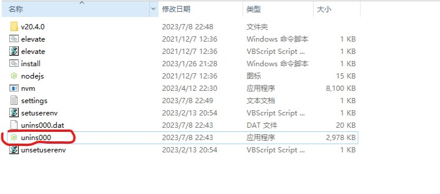

# nvm官网安装，不踩坑。
> nvm 是node.js的版本管理器，设计为按用户安装并按 shell 调用。nvm适用于任何兼容 POSIX 的 shell（sh、dash、ksh、zsh、bash），特别是在以下平台上：unix、macOS 和windows WSL。
https://github.com/nvm-sh/nvm 官网

## 全流程无脑安装
```
1. https://github.com/coreybutler/nvm-windows/releases/download/1.1.11/nvm-setup.exe 下载无脑next
2. cmd nvm 查看是否安装成功、
3. nvm node_mirror https://npmmirror.com/mirrors/node/
4. nvm install 16.9.1 安装最新版本
5. nvm use 16.9.1 切换版本
6. node -v
7. npm -v
8. npm install -g cnpm --registry=https://registry.npmmirror.com cnpm 安装
9. 安装完成了
```
## nvm 代理设置详细配置见B站
### 1. 阿里云npm镜像
```
https://npmmirror.com/
nvm node_mirror https://npmmirror.com/mirrors/node/
```
### 2. 设置代理
```
设置代理
nvm proxy http://127.0.0.1:7890
取消代理
nvm proxy " "
```
## 基本命令
```
nvm install 16.9.1 安装
nvm use 16.9.1 切换
nvm uninstall 16.9.1 卸载
nvm root 查看安装目录
```

## nvm 卸载 双击执行
